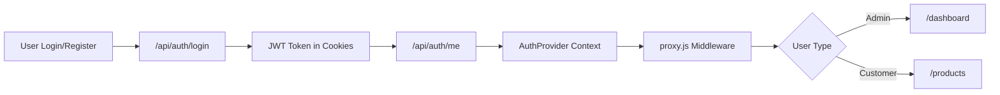
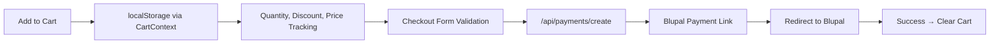

<div align="center">

# 🛍️ ShopStack

### 🚀 A Modern Full-Stack E-Commerce Platform for the Iranian Market


[](https://nextjs.org/)
[](https://react.dev/)
[](https://tailwindcss.com/)
[](https://www.mongodb.com/)
[](https://blupal.ir/)

[✨ Features](#-features) • [🚀 Tech Stack](#-tech-stack) • [🏗️ Architecture](#️-architecture) • [📦 Getting Started](#-getting-started) • [🤝 Contributing](#-contributing) • [🌐 Live Demo](#-live-demo)

---

</div>

## 🌐 Live Demo

<div align="center">

### 🎯 Try It Now!

| Platform | URL | Credentials |
|----------|-----|-------------|
| 🛍️ **Customer Store** | [https://shop-stack-black.vercel.app/](https://shop-stack-black.vercel.app/) | Register your own account |
| 🎛️ **Admin Dashboard** | [https://shop-stack-rqve.vercel.app/](https://shop-stack-rqve.vercel.app/) | **Email:** `admin.limited@gmail.com`<br/>**Password:** `Admin@1234` |

</div>

---

### 🔐 Admin Demo Access

> **⚠️ Note:** This is a **read-only demo** environment. You can view all sections except payment information, but **cannot modify any data**. Changes are not persisted.

```text
📧 Email:    admin.limited@gmail.com
🔑 Password: Admin@1234
```

**What you can do in Admin Demo:**
- 📊 View dashboard analytics & charts
- 📦 Manage products (create, edit, delete)
- 📋 Track orders & update statuses
- 👥 View customer accounts
- ⚙️ Configure system settings
- 📈 See real-time revenue & order statistics

---

### 🛍️ Customer Store Demo

**Features to explore:**
- 🏠 Browse beautiful home page with animations
- 📦 Shop products by category
- 🛍️ Add to cart & manage quantities
- 💳 Test checkout flow (Blupal sandbox)
- 👤 Register/Login with email or phone
- 📱 Fully responsive mobile experience
- ✨ Smooth Framer Motion animations

---

## ✨ Features

### 🛒 **Customer Storefront** — *Beautiful & Intuitive Shopping Experience*

| Feature | Description |
|---------|-------------|
| 🏠 **Home Page** | Hero section, latest products, categories, features, testimonials, CTA with animated elements |
| 📦 **Product Listing** | Browse by category with pagination & search |
| 🔍 **Product Detail** | Full info with images, pricing, reviews |
| 🛍️ **Shopping Cart** | Persistent localStorage, quantity management, discounts, free shipping threshold |
| 💳 **Checkout & Payment** | Online order form + **Blupal Payment Gateway** integration |
| 🔐 **Authentication** | Login/Register with email/phone, JWT sessions |
| 👤 **User Profile** | Manage personal information |
| 📱 **Responsive Design** | Mobile hamburger menu, glassmorphism UI, RTL support |
| ✨ **Smooth Animations** | Framer Motion, AOS scroll animations, transitions |

---

### 📊 **Admin Dashboard** — *Powerful Management Tools*

| Feature | Description |
|---------|-------------|
| 📈 **Dashboard Overview** | Real-time stats, live ticker, revenue charts, order status donut, recent orders, top products |
| 📦 **Product Management** | Full CRUD with categories, brands, tags, inventory tracking |
| 📋 **Order Management** | Status workflow: Pending → Processing → Shipped → Delivered/Cancelled/Returned |
| 👥 **Customer Management** | View & manage customer accounts |
| ⚙️ **Settings** | System configuration |
| 🔐 **Admin Auth** | Dedicated authentication with RBAC |
| 📊 **Data Visualization** | Recharts-powered analytics |

---

### 🔧 **Technical Features** — *Production-Ready Architecture*

- ⚡ **Rate Limiting** — In-memory API rate limiting with configurable thresholds
- 🔐 **Token-based Auth** — JWT + cookie-based session management
- 💰 **Blupal Payment** — Invoice creation, payment links, webhooks, transaction tracking
- 🔍 **SEO Optimized** — Full metadata, Open Graph, Twitter Cards
- 🛡️ **Error Handling** — Error boundaries, loading states, toast notifications

---

## 🚀 Tech Stack

<div align="center">

| Layer | Technology | Version |
|-------|------------|---------|
| 🏗️ **Framework** | [Next.js](https://nextjs.org/) | 16 (App Router) |
| ⚛️ **UI Library** | [React](https://react.dev/) | 19 |
| 🎨 **Styling** | [Tailwind CSS](https://tailwindcss.com/) | v4 |
| 🗄️ **Database** | [MongoDB](https://www.mongodb.com/) + [Mongoose](https://mongoosejs.com/) | Latest |
| 🔐 **Authentication** | [JWT](https://jwt.io/) + [Bcryptjs](https://www.npmjs.com/package/bcryptjs) | Latest |
| 💳 **Payment** | [Blupal](https://blupal.ir/) | Iranian Gateway |
| 📝 **Forms** | [React Hook Form](https://react-hook-form.com/) + [Yup](https://github.com/jquense/yup) | Latest |
| 🎬 **Animations** | [Framer Motion](https://www.framer.com/motion/) + [AOS](https://michalsnik.github.io/aos/) | Latest |
| 📊 **Charts** | [Recharts](https://recharts.org/) | Latest |
| 🎯 **Icons** | [Lucide React](https://lucide.dev/) + Custom SVGs | Latest |
| 🔔 **Notifications** | [react-hot-toast](https://react-hot-toast.com/) | Latest |
| 🖼️ **Image Processing** | [Sharp](https://sharp.pixelplumbing.com/) | Latest |
| 🛠️ **Utilities** | [Lodash](https://lodash.com/) + [Persian Tools](https://www.npmjs.com/package/persian-tools) | Latest |

</div>

---

## 🏗️ Architecture

```text
apps/
├── 🌐 frontend/                    # Customer Store (Port 3000)
│   ├── app/
│   │   ├── page.jsx                # 🏠 Home Page
│   │   ├── products/               # 📦 Product Listing & Detail
│   │   ├── cart/                   # 🛍️ Shopping Cart & Checkout
│   │   ├── payment/                # 💳 Payment Page
│   │   ├── auth/                   # 🔐 Login & Register
│   │   ├── profile/                # 👤 User Profile
│   │   ├── about/                  # ℹ️ About Page
│   │   ├── contact/                # 📞 Contact Page
│   │   ├── api/                    # 🔌 API Routes (products, auth, cart, orders, payments, contact)
│   │   ├── layout.js               # 🎭 Root Layout (providers, metadata, SEO)
│   │   └── globals.css             # 🎨 Global Styles
│   ├── components/                 # 🧩 Shared & Feature Components
│   ├── context/                    # 🔄 Cart & Auth Context Providers
│   ├── models/                     # 🗄️ Mongoose Models (User, Product, Order, Payment)
│   ├── lib/                        # 🛠️ Utilities (auth, validation, db connection)
│   ├── data/                       # 📊 Static Data (categories, testimonials)
│   ├── metadata/                   # 🔍 SEO Metadata Configs
│   └── proxy.js                    # ⚡ Rate Limiting & Auth Middleware
│
├── 🎛️ admin/                       # Admin Dashboard (Port 3001)
│   ├── app/
│   │   ├── dashboard/              # 📊 Admin Dashboard
│   │   │   ├── page.jsx            # Overview (stats, charts, recent orders, top products)
│   │   │   ├── products/           # 📦 Product CRUD
│   │   │   ├── orders/             # 📋 Order Management
│   │   │   ├── customers/          # 👥 Customer Management
│   │   │   ├── settings/           # ⚙️ System Settings
│   │   │   └── layout.jsx          # 🎭 Dashboard Layout with Sidebar
│   │   ├── auth/login/             # 🔐 Admin Login
│   │   ├── api/                    # 🔌 Admin API Routes (dashboard, products, orders, users, categories, settings, messages)
│   │   └── layout.jsx              # 🎭 Auth Layout
│   ├── components/                 # 🧩 Admin Components
│   └── lib/                        # 🛠️ Admin Utilities
```

---

## 📦 Getting Started

### 📋 Prerequisites

- ✅ Node.js 18+ & npm
- ✅ MongoDB (local or cloud)
- ✅ Blupal merchant account (for payments)
- ✅ JWT secret key

### 🔐 Environment Variables

<details>
<summary><b>🌐 Frontend (.env)</b></summary>

```env
NEXT_PUBLIC_API_URL=http://localhost:3000
NEXT_PUBLIC_ADMIN_URL=http://localhost:3001
JWT_SECRET=your-super-secret-key
```

</details>

<details>
<summary><b>🎛️ Admin (.env)</b></summary>

```env
NEXT_PUBLIC_API_URL=http://localhost:3000
NEXT_PUBLIC_ADMIN_URL=http://localhost:3001
JWT_SECRET=your-super-secret-key
```

</details>

### ⚡ Installation

```bash
# 📥 Clone the repository
git clone https://github.com/Mr-Syntax1/ShopStack.git
cd ShopStack/apps

# 📦 Install frontend dependencies
cd frontend
npm install

# 📦 Install admin dependencies
cd ../admin
npm install
```

### 🏃 Running the Project

```bash
# Terminal 1 — 🌐 Frontend (Customer Store)
cd frontend
npm run dev
# → http://localhost:3000

# Terminal 2 — 🎛️ Admin (Dashboard)
cd admin
npm run dev
# → http://localhost:3001
```

### 🏭 Building for Production

```bash
cd frontend
npm run build
npm start

cd ../admin
npm run build
npm start
```

---

## 📂 Project Structure Overview

| App | Purpose | Port |
|-----|---------|------|
| `frontend/` | 🛍️ Customer storefront with shopping, cart, checkout | 3000 |
| `admin/` | 🎛️ Admin dashboard with management tools | 3001 |

---
## 🔑 Key Concepts

### 🔐 Authentication Flow



1. 📝 User registers/logs in via `/api/auth/login` or `/api/auth/register`
2. 🎫 Server returns JWT token stored in cookies
3. 👤 Frontend reads user info from `/api/auth/me`
4. 🔄 `AuthProvider` context manages global auth state
5. ⚡ `proxy.js` middleware validates tokens on protected routes
6. 🎯 Role-based routing: admins → dashboard, users → storefront

---

### 🛍️ Cart Flow



1. 🛒 Cart stored in `localStorage` via `CartContext`
2. 📦 Products added with quantity, discount, price tracking
3. ✅ Checkout validates form with Yup schema via React Hook Form
4. 💳 Order submitted to `/api/payments/create` → Blupal payment link
5. 🔄 User redirected to Blupal for payment
6. 🗑️ Cart cleared on successful order creation

---

### 🎛️ Admin Access Control

- 🗄️ **Separate Admin Database** — Read-only mode supported
- ⚠️ **Visual Warning Banner** — When in read-only mode
- 🔐 **Role-Based Routing** — Regular users → storefront, admins → dashboard

</details>

---

## 🤝 Contributing

We love contributions! 🎉 Follow these steps:

```bash
# 1️⃣ Fork the repository
# 2️⃣ Create your feature branch
git checkout -b feature/amazing-feature

# 3️⃣ Commit your changes
git commit -m '✨ Add amazing feature'

# 4️⃣ Push to the branch
git push origin feature/amazing-feature

# 5️⃣ Open a Pull Request
```

---

<div align="center">

### Made with ❤️ by the **GreenRose**

[](https://github.com/Mr-Syntax1/ShopStack/stargazers)
[](https://github.com/Mr-Syntax1/ShopStack/fork)
[](https://github.com/Mr-Syntax1/ShopStack/issues)

⭐ **Star this repo if you found it helpful!** ⭐

</div>
